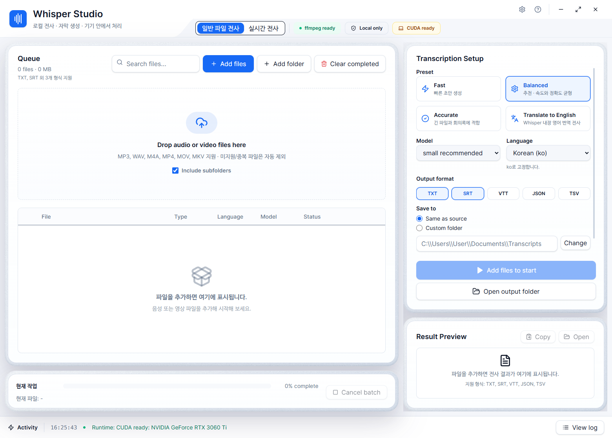

# Whisper Studio

> Local-first transcription workspace from the `whisper-batch-tool` repository.



`Private audio → Local transcription → TXT / SRT / VTT`<br>
`Electron · React · Python · Local-first · Automated desktop smoke test`<br>
`Python ↔ Electron worker/IPC boundary verified in CI`

Whisper Studio는 Whisper 기반 오디오/비디오 배치 전사 데스크톱 앱입니다. 현재 저장소의 공식 제품 타깃은 `desktop/` 아래 Electron/React 앱입니다. 저장소 slug는 `whisper-batch-tool`이며, 기존 `whisper_gui.py` 기반 Tk/PyInstaller 앱은 이전 릴리스를 유지하기 위한 legacy 경로로 남겨 둡니다.

이 저장소는 단순한 스크립트에서 로컬 전사 제품으로 확장해 온 과정을 보여 줍니다. 공식 제품 경로와 legacy 경로, 현재 가능한 검증과 아직 남은 릴리스 결정을 구분해 기록합니다.

[제품 결정 기록](docs/DECISIONS.md) · [기여/브랜치/커밋 규칙](CONTRIBUTING.md) · [배포 전략](docs/DISTRIBUTION.md) · [제품 요구사항](docs/PRD.md) · [GitHub 이슈](https://github.com/johneybi/whisper-batch-tool/issues)

## 문제와 해결

Whisper를 직접 실행하려면 Python 패키지, FFmpeg, 모델 파일, CPU/GPU 환경을 준비해야 합니다. 긴 녹음이나 여러 강의 파일을 처리할 때 파일 큐, 진행률, 취소, 자막 포맷 변환까지 직접 관리해야 하는 것도 반복 비용입니다.

이 프로젝트는 그 흐름을 로컬 데스크톱 앱으로 묶습니다. 파일/폴더를 큐에 넣고 모델·언어·장치를 선택해 순차 처리하며 TXT/SRT/VTT/JSON/TSV를 생성합니다. 별도 라이브 워크스페이스에서는 YouTube URL을 청크 단위로 받아 누적 지식으로 저장합니다.

## 제품 선택과 피봇

초기 앱은 `whisper_gui.py` 기반 Tk/PyInstaller 경로였습니다. 작업 전환·진행률·취소·라이브 상태가 늘면서 UI와 릴리스 경계를 설명하기 어려워졌고, 다음처럼 방향을 좁혔습니다.

1. `desktop/` Electron/React를 공식 제품 경험으로 삼고 새 기능을 우선 구현합니다.
2. `transcriber_core.py`는 Electron worker와 legacy 앱이 공유해 검증된 로컬 처리와 기존 사용자의 재현성을 보존합니다.
3. 라이브 전사는 무제한 대시보드가 아니라 최대 두 실행, 명시적 중지, 읽기 쉬운 누적 저장에 집중합니다.
4. Electron 패키징과 runtime 전달 정책이 확정되기 전에는 legacy PyInstaller 산출물을 새 공식 릴리스로 포장하지 않습니다.

이 선택의 이유와 수용 기준은 [제품 결정 기록](docs/DECISIONS.md)과 [GitHub 이슈](https://github.com/johneybi/whisper-batch-tool/issues)에 남깁니다.

## Current Target

See [Demo guide](docs/DEMO.md) for screenshot provenance and reproducible batch/live walkthroughs. See [Product evolution](docs/PRODUCT_EVOLUTION.md) for the script → Tk → Electron → live-workspace decision timeline.

- 공식 앱: Electron/React/shadcn desktop app in `desktop/`
- 표시 제품명: `Whisper Studio` (`desktop/package.json`의 `name`은 npm 호환성을 위한 내부 식별자)
- 공유 전사 코어: `transcriber_core.py`
- Electron worker: `desktop/python/worker.py`
- Legacy 앱: `whisper_gui.py`, `WhisperBatchTranscriber.spec`, 기존 PyInstaller release scripts

GitHub Releases에는 앞으로 Electron 앱 산출물을 올리는 것을 기준으로 합니다. 기존 PyInstaller 산출물은 새 공식 릴리스로 자동 게시하지 않습니다.

## Architecture

```text
Electron main ── preload/IPC ──> React renderer (`desktop/src`)
     ├── Python worker ──> `transcriber_core.py` ──> Whisper + FFmpeg
     └── live adapter ──> `services/live-engine` (선택적 로컬 서비스)

Legacy compatibility: `whisper_gui.py` + PyInstaller scripts
```

- `desktop/electron/`: 창, IPC 보안, worker/라이브 서비스 수명주기, 스케줄링
- `desktop/src/`: 파일 전사 화면과 라이브 전사 워크스페이스
- `desktop/python/worker.py`: Electron과 Python 사이의 실행 경계와 환경 진단
- `transcriber_core.py`: 모델 로드, 미디어 처리, 반복/환각 필터, 출력 writer
- `services/live-engine/`: YouTube 청크 캡처와 누적 지식을 담당하는 선택적 런타임

## Development

Windows에서 현재 공식 Electron 앱을 실행합니다.

```powershell
powershell -ExecutionPolicy Bypass -File .\scripts\run_desktop_dev_windows.ps1
```

처음 실행하거나 desktop 의존성을 다시 설치해야 하면 `-Install`을 붙입니다.

```powershell
powershell -ExecutionPolicy Bypass -File .\scripts\run_desktop_dev_windows.ps1 -Install
```

Electron 앱은 `WHISPER_PYTHON`이 있으면 그 값을 사용합니다. 없으면 루트의 `.release-venv`, `venv`, `C:\whisper\torch-env\Scripts\python.exe`, 시스템 Python 순서로 worker 실행 Python을 찾습니다.

## Live Transcription Integration

Electron 앱은 상단에서 `일반 파일 전사`와 `실시간 전사` 두 작업으로 전환합니다. 실시간 전사는 저장소의 `services/live-engine`을 기본 로컬 서비스로 시작하고, 외부 호환 런타임은 환경 변수로 연결합니다.

- YouTube 라이브 또는 일반 영상 URL 전사
- 방송 시작점 또는 현재 라이브 지점 선택
- 15/30/60초 연속 청크 전사
- 최대 두 방송 동시 캡처와 실행별 중지
- `data/knowledge`에 누적 전사 저장

다른 런타임 루트를 사용할 때는 다음처럼 지정합니다.

```powershell
$env:WHISPER_LIVE_ENGINE_ROOT = "D:\tools\auto-news-scripter"
```

선택한 런타임의 `.venv`, `uvicorn`, FFmpeg, 모델 구성이 먼저 준비되어 있어야 합니다. Electron은 라이브 서비스를 자동으로 시작하고 앱 종료 시 자신이 시작한 서비스만 종료합니다. 일반 파일 전사와 실시간 전사는 GPU 메모리 충돌을 피하기 위해 동시에 실행되지 않습니다.

## Verification

Python 코어 테스트:

```powershell
python -m unittest discover -s tests
```

Electron UI 빌드와 렌더 smoke:

```powershell
cd desktop
npm run build
npm run smoke:render
```

Worker self-test:

```powershell
python desktop\python\worker.py self-test
python desktop\python\worker.py runtime-info
```

`desktop-ci.yml`은 위 worker self-test와 Electron IPC 보안 테스트를 같은 Windows job에서 실행해 Python ↔ Electron 경계를 자동 검증합니다.

## Distribution Direction

배포 기준은 Electron 앱입니다.

1. `desktop/` 앱을 공식 사용자 경험으로 유지합니다.
2. `transcriber_core.py`는 Electron worker와 legacy Tk 앱이 공유할 수 있지만, 새 기능은 Electron 경로에서 먼저 검증합니다.
3. GitHub Actions의 기본 CI는 Electron 앱 빌드와 worker self-test를 검증합니다.
4. 기존 PyInstaller release workflow는 legacy 수동 빌드로만 유지합니다.
5. Electron 패키징이 추가되기 전까지 GitHub Release에는 legacy PyInstaller 산출물을 새 공식 릴리스로 올리지 않습니다.

Electron 패키징을 제품 릴리스로 완성하려면 다음 단계에서 Windows installer/portable ZIP, macOS DMG/ZIP, Python runtime 포함 정책을 확정해야 합니다.

## Release History

이 저장소에는 실제 shipping 경로와 현재 전환 상태가 함께 남아 있습니다.

- [V1.00 Windows legacy release](https://github.com/johneybi/whisper-batch-tool/releases/tag/release) — 기존 Tk/PyInstaller 설치 프로그램
- [v1.1.0 macOS draft](https://github.com/johneybi/whisper-batch-tool/releases/tag/untagged-5fbc2a76bd6f86793fd8) — DMG/ZIP, unsigned/unnotarized; Electron 공식 패키징 전 단계

새 공식 릴리스는 Electron artifact와 Python/Whisper/FFmpeg runtime 전달 정책이 검증된 뒤 `v2.0.0-beta.1`부터 시작합니다. 릴리스 노트에는 사용자 변화, 선택 이유, 설치, 검증, 알려진 한계를 함께 기록합니다.

## Supported Inputs

ffmpeg가 처리할 수 있는 일반적인 오디오/비디오 파일을 대상으로 합니다.

- Audio: `mp3`, `wav`, `m4a`, `flac`, `aac`, `ogg`, `opus`, `wma`, `aiff`, `alac`, `amr`
- Video: `mp4`, `mov`, `mkv`, `webm`, `avi`, `wmv`, `m4v`, `flv`, `mpeg`, `mpg`, `m2ts`, `mts`, `ts`

## Output Formats

- `TXT`: 전체 텍스트와 세그먼트
- `SRT`: 일반 자막
- `VTT`: 웹 자막
- `JSON`: Whisper 결과에 가까운 구조화 데이터
- `TSV`: 세그먼트 표 데이터

## Legacy PyInstaller App

기존 Tk 앱은 유지보수와 이전 릴리스 재생성을 위해 남겨 둡니다.

Windows legacy 실행:

```powershell
powershell -ExecutionPolicy Bypass -File .\scripts\run_dev_windows.ps1
```

Windows legacy 빌드:

```powershell
powershell -ExecutionPolicy Bypass -File .\scripts\build_release_windows.ps1
```

macOS legacy 빌드:

```bash
chmod +x build_macos.sh scripts/build_release_macos.sh
./build_macos.sh
```

이 경로는 더 이상 새 공식 UI 배포 경로가 아닙니다.

## Current Result and Limits

License status: this public repository does not yet declare reuse terms; see [Issue #5](https://github.com/johneybi/whisper-batch-tool/issues/5) before redistributing code or artifacts.

현재 저장소에는 Electron UI, Python worker 경계, 출력 포맷, 진행률/취소, 라이브 실행·중지·스케줄링·읽기 화면, IPC 보안 테스트가 구현되어 있습니다. 다만 다음 항목은 아직 새 공식 릴리스 계약으로 확정되지 않았습니다.

- Electron용 Windows installer/portable ZIP 및 macOS DMG/ZIP의 최종 패키징
- Python/Whisper/FFmpeg를 최종 사용자에게 전달하는 runtime 정책
- macOS Developer ID 서명과 notarization
- 화자 분리, 협업 편집, 클라우드 전사
- 취소 시 Whisper 프로세스를 우아하게 정리하는 동작

실제 전사 품질은 모델·언어·오디오 품질·장치에 따라 달라지므로 특정 WER 수치를 제품 성과로 주장하지 않습니다. 먼저 실패 원인을 설명하고 완료된 파일을 보존하는 것이 이 저장소의 품질 방향입니다.

## Roadmap

우선순위는 [GitHub 이슈](https://github.com/johneybi/whisper-batch-tool/issues)로 추적합니다.

1. Electron runtime/모델/FFmpeg 패키징 정책 확정 및 실제 배포물 검증
2. 부분 실패·취소 후 완료된 파일을 보존하고 실패 항목만 재실행
3. 모델/장치/파일 길이별 작은 벤치마크와 첫 실행 진단 화면
4. macOS 서명·notarization 및 사용자용 설치 가이드
5. 필요성이 확인될 때만 화자 분리·고급 Whisper 파라미터·다국어 UI 확장

## Important Files

Documentation: [PRD](docs/PRD.md) · [Decisions](docs/DECISIONS.md) · [Product evolution](docs/PRODUCT_EVOLUTION.md) · [Demo guide](docs/DEMO.md) · [Contributing](CONTRIBUTING.md)

- `desktop/`: 공식 Electron/React 데스크톱 앱
- `desktop/electron/main.cjs`: Electron main process와 IPC
- `desktop/electron/preload.cjs`: renderer에 노출되는 안전 API 표면
- `desktop/electron/liveService.cjs`: Auto News Scripter 라이브 서비스 수명주기와 API 어댑터
- `desktop/src/LiveTranscriptionWorkspace.jsx`: 실시간 전사 작업 화면
- `desktop/python/worker.py`: Electron에서 호출하는 Python worker
- `desktop/src/`: React UI
- `transcriber_core.py`: Whisper 전사 코어, 출력 생성, ffmpeg 준비
- `runtime_manager.py`: legacy 앱의 runtime 선택/설치 관리
- `tests/`: 모델 다운로드 없이 빠르게 실행 가능한 코어 테스트
- `whisper_gui.py`: legacy Tk GUI
- `WhisperBatchTranscriber.spec`: legacy PyInstaller 설정
- `scripts/build_release_windows.ps1`: legacy Windows PyInstaller 빌드
- `.github/workflows/desktop-ci.yml`: 공식 Electron 타깃 CI
- `.github/workflows/build-release.yml`: legacy PyInstaller 수동 빌드
