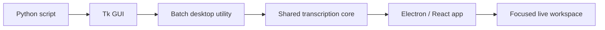

# Product Evolution

이 프로젝트의 핵심 결과는 Whisper 호출 자체가 아니라, 복잡한 로컬 AI 실행 환경을 사람이 사용할 수 있는 제품 흐름으로 추상화한 과정입니다.



## Decision loop

각 단계는 기능을 늘리기 위한 확장이 아니라, 관찰된 문제에 대한 선택이었습니다.

```text
Problem → Decision → Trade-off → Implementation → Verification
```

| 단계 | 문제 | 선택과 trade-off | 구현 증거 |
| --- | --- | --- | --- |
| Script → Tk | 반복 실행과 파일 선택이 불편함 | GUI를 도입하되 legacy 유지 비용 발생 | `whisper_gui.py` |
| Tk → shared core | UI와 전사 로직이 강하게 얽힘 | 코어를 분리하고 API 경계를 추가 | `transcriber_core.py`, `desktop/python/worker.py` |
| Tk → Electron | 진행률·취소·작업 전환을 한 제품으로 설명하기 어려움 | 새 UX를 Electron에 집중하고 Tk는 재현용으로 한정 | `desktop/`, [Issue #1](https://github.com/johneybi/whisper-batch-tool/issues/1) |
| Batch → live | 실행 중인 소스도 읽고 축적할 필요가 생김 | 무제한 스트림 대신 최대 두 실행과 명시적 중지 | `services/live-engine/`, [Issue #2](https://github.com/johneybi/whisper-batch-tool/issues/2) |
| Prototype → release target | 여러 산출물을 공식 제품으로 부르기 모호함 | Electron 패키징 전까지 legacy release를 새 공식 릴리스로 부르지 않음 | [Issue #3](https://github.com/johneybi/whisper-batch-tool/issues/3) |

## What this demonstrates

- Python, FFmpeg, 모델, CPU/GPU, 파일 관리, 출력 포맷, 실패 상태를 하나의 작업 흐름으로 묶었다.
- 기능보다 제품 경계를 먼저 정하고, 하지 않을 일을 이슈와 결정 기록으로 남겼다.
- 테스트 가능한 worker/IPC 경계와 smoke render를 통해 UI가 실제 실행 가능한지 확인한다.
- 정확도 수치를 과장하기보다 환경 진단과 부분 결과 보존을 다음 품질 우선순위로 삼았다.
